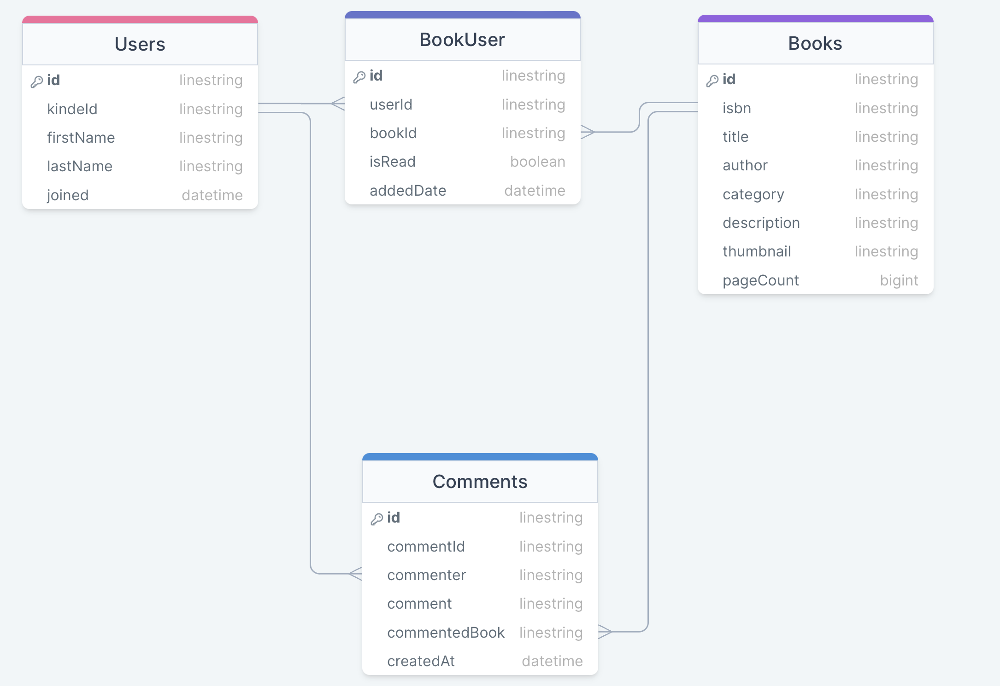

# Project Title

bookSquirrel

## Overview

bookSquirrel is a place for avid book readers to find books, add them to a reading list and discuss with others what they think of those books.

### Problem

In today's fast-paced digital age, individuals are constantly seeking efficient ways to discover, manage, and engage with the vast world of literature. Traditional methods of tracking reading preferences and sharing book recommendations often lack organization and personalization. There is a pressing need for a user-friendly and comprehensive book list app that addresses these challenges, providing readers with the ability to efficiently find books, streamline a reading list, and engage in book discussions.

### User Profile

- Book readers:
  - wanting to keep track of the books they want to read
  - wanting to keep track of the books they have read
  - discuss with others who have also read that book

### Features

- As a user, I want search for books by title, author and genre
- As a user, I want save a book to a reading list
- As a user, I want mark my book as read and move it to a read list
- As a user, I want to discuss with others that have also read a book

- As a user, I want to be able to create an account to manage reading list
- As a user, I want to be able to login to my account to manage my reading list

## Implementation

### Tech Stack

- React
- JavaScript
- Supabase
- Express
- Client libraries:
  - react
  - react-router
  - react-modal
  - moment
  - axios
- Server libraries:
  - prisma
  - express

### APIs

Google Books API

### Sitemap

- Login
- Home/Search Page
- Reading List
- Read List
- Book Discussion
- About

### Mockups

#### Login Page


#### Home Search Page


#### Reading List Page


#### Read List Page


#### Book Discussion Page


### Data



### Endpoints

\*\*GET /users

- Get all users

Response:

```
[
{
"id": "clrhvvw7000018ls455ocuk7b",
"kindeId": "unique_user_id_1",
"firstName": "John",
"lastName": "Doe",
"joined": "2024-01-17T14:34:10.224Z"
},
{
"id": "clrhvwea600028ls4jydasgkf",
"kindeId": "unique_user_id_2",
"firstName": "Jane",
"lastName": "Dan",
"joined": "2024-01-17T14:34:33.671Z"
},
]
```

\*\*POST /users

- Add a user

Body:

```
{
"kindeId": "unique_user_id_1",
"firstName": "John",
"lastName": "Doe"
}
```

Response:

"Token is valid"

\*\*GET books/:userId/unread

- Get all unread books for a user

[
{
"id": "clrkiy8f5000ailvyl04a8xrq",
"userId": "unique_user_id_2",
"bookId": "123456789",
"isRead": false,
"addedDate": "2024-01-19T10:55:22.912Z",
"book": {
"id": "clrkixzc60006ilvysf7a911s",
"isbn": "123456789",
"title": "New Sample Book Title",
"author": "New Sample Author",
"category": "Non-Fiction",
"description": "A new sample book description",
"thumbnail": "https://newexample.com/book-thumbnail.jpg",
"pageCount": 600
}
},
{
"id": "clrkj3l2c000jilvykpkkp5is",
"userId": "unique_user_id_2",
"bookId": "5432109876",
"isRead": false,
"addedDate": "2024-01-19T10:59:32.579Z",
"book": {
"id": "clrkj14it000filvyhhgf01x6",
"isbn": "5432109876",
"title": "New New Sample Book Title",
"author": "New New Sample Author",
"category": "Biography",
"description": "A new new sample book description",
"thumbnail": "https://newnewexample.com/book-thumbnail.jpg",
"pageCount": 1000
}
}
]

\*\*GET /books/:userId/read

- Get all read books for a user

[
{
"id": "clrhy0ybg0001tx5zme2wspom",
"userId": "unique_user_id_2",
"bookId": "9780123456789",
"isRead": true,
"addedDate": "2024-01-17T15:34:05.497Z",
"book": {
"id": "clrhxpfyk0000fpjey11dhgvf",
"isbn": "9780123456789",
"title": "Sample Book Title",
"author": "Sample Author",
"category": "Fiction",
"description": "A sample book description",
"thumbnail": "https://example.com/book-thumbnail.jpg",
"pageCount": 300
}
}
]

\*\*POST /books

- Add a book

Body:

{
"userId": "unique_user_id_2",
"bookId": "9780123456789",
"title": "Sample Book Title",
"author": "Sample Author",
"category": "Fiction",
"description": "A sample book description",
"thumbnail": "https://example.com/book-thumbnail.jpg",
"pageCount": 300
}

Response:

{
"id": "clrp5wf0r0002qs36m5yd25ly",
"userId": "unique_user_id_10",
"bookId": "8345873898345",
"isRead": false,
"addedDate": "2024-01-22T16:48:54.020Z"
}

\*\*PUT /books/:userId/update/:bookId

- Update a book to isRead for a user

{
"id": "clrp5wf0r0002qs36m5yd25ly",
"userId": "unique_user_id_10",
"bookId": "8345873898345",
"isRead": true,
"addedDate": "2024-01-22T16:48:54.020Z"
}

\*\*DELETE /books/:userId/delete/:bookId

- Delete a book for a user

No response

\*\*GET /comments/:bookId/comments

- Get all comments for a book

[
{
"commentId": "clrkjhjs90003v63634m6xrvd",
"commenter": "unique_user_id_1",
"comment": "This book is bad!",
"commentedBook": "5432109876",
"createdAt": "2024-01-19T11:10:24.105Z",
"user": {
"id": "clrhvvw7000018ls455ocuk7b",
"kindeId": "unique_user_id_1",
"firstName": "John",
"lastName": "Doe",
"joined": "2024-01-17T14:34:10.224Z"
}
},
{
"commentId": "clrkji3oz0005v636ats51alp",
"commenter": "unique_user_id_2",
"comment": "This book is average!",
"commentedBook": "5432109876",
"createdAt": "2024-01-19T11:10:49.907Z",
"user": {
"id": "clrhvwea600028ls4jydasgkf",
"kindeId": "unique_user_id_2",
"firstName": "Jane",
"lastName": "Dan",
"joined": "2024-01-17T14:34:33.671Z"
}
}
]

\*\*POST /comments/:userId/comment/:bookId

- Post a comment for a user

Body:

{
"comment": "This book is a great book! I loved it."
}

Response:

{
"commentId": "clrp691bk00016k5amb1nu0l5",
"commenter": "unique_user_id_3",
"comment": "This book is a great book! I loved it.",
"commentedBook": "123456789",
"createdAt": "2024-01-22T16:58:42.798Z"
}

\*\*DELETE /comments/:userId/comment/:commentId/delete

- Delete a comment for a user

No response

### Auth

- Using KindeAuth's authentication functionality

## Roadmap

- Create client

  - react project with routes and boilerplate pages

- Create server

  - express project with routing, with placeholder 200 responses

- Create migrations

- Deploy client and server projects so all commits will be reflected in production

- Feature: Book search page

  - Implement book search using Google Books API
  - Create POST /book

- Feature: Reading list page

  - Implement reading list
  - Create GET /books/:userId/unread
  - Create PUT /books/:userId/update/:bookId
  - Create DELETE /books/:userId/delete/:bookId

- Feature: Read list page

  - Implement read list page
  - Create GET /books/:userId/read

- Feature: Discussion Page

  - Implement book discussion page
  - Create GET /comments/:bookId/comments
  - Create POST /comments/:userId/comment/:bookId
  - CREATE DELETE /comments/:userId/comment/:commentId/delete

- Feature: About Page

  - Implement about page

- Feature: Login

  - Implement login page

- Feature: Implement JWT tokens via KindeAuth

  - Server: Update expected requests / responses on protected endpoints
  - Client: Store JWT in local storage, include JWT on axios calls

- Bug fixes

- DEMO DAY

## Nice-to-haves

- Viewing other peoples lists
- Giving the comments more of a social media feel (i.e. liking, rating etc)
