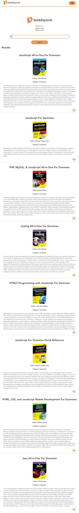
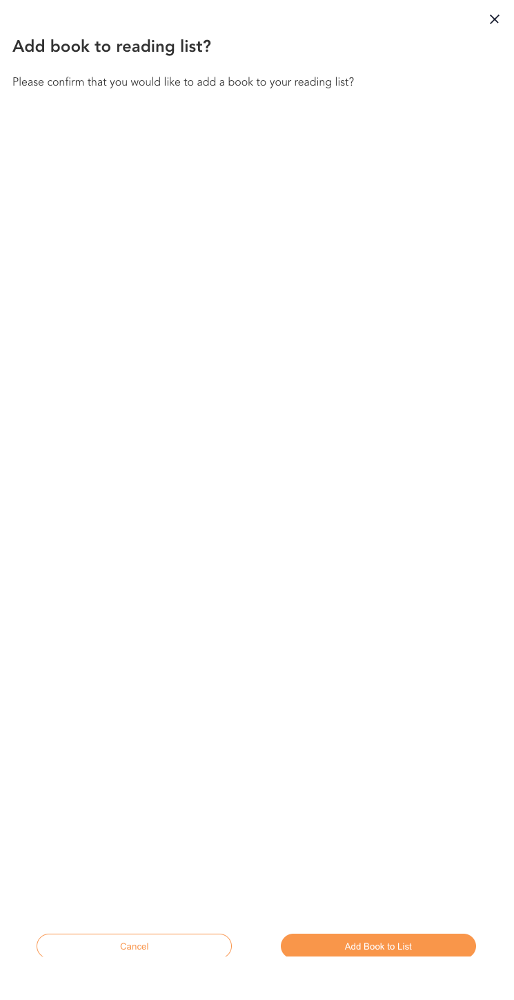

# Project Title

bookSquirrel

## Overview

bookSquirrel is a place for avid book readers to find books, add them to a reading list and discuss with others what they think of those books.

### Problem

In today's fast-paced digital age, individuals are constantly seeking efficient ways to discover, manage, and engage with the vast world of literature. Traditional methods of tracking reading preferences and sharing book recommendations often lack organization and personalization. There is a pressing need for a user-friendly and comprehensive book list app that addresses these challenges, providing readers with the ability to efficiently find books, streamline a reading list, and engage in book discussions.

### User Profile

- Book readers:
  - wanting to keep track of the books they want to read
  - wanting to keep track of the books they have read
  - discuss with others who have also read that book

### Features

- As a user, I want search for books by title, author and genre
- As a user, I want save a book to a reading list
- As a user, I want mark my book as read and move it to a read list
- As a user, I want to discuss with others that have also read a book

- As a user, I want to be able to create an account to manage reading list
- As a user, I want to be able to login to my account to manage my reading list

### Development Environment Installation Instructions

First run in the terminal for bookSquirrel and [book-Squirrel-backend][https://github.com/michaelesnowdon/booksquirrel-backend] to download the node modules:

```
npm install
```

For BrainStation, please then add the .env files that I have provided in a separate file.

In bookSquirrel, run to start the client:

```
npm start
```

And in bookSquirrel-backend, run to start the server:

```
node index.js
```

Note: both Google Books API and Kinde Auth have been configured to run on Localhost:3000 and https://booksquirrel.netlify.app/

### Tech Stack

- React
- JavaScript
- Supabase
- Express
- Kinde Auth
- Client libraries:
  - react
  - react-router
  - react-modal
  - moment
  - axios
- Server libraries:
  - prisma
  - express

### APIs

Google Books API

### Sitemap

- Login
- Home/Search Page
- Reading List
- Read List
- Book Discussion
- About

### Page Screenshots

#### Login Page


#### Home Search Page


#### Book Searches



#### Add Book To Reading List Modal



#### Reading List Page


#### Mark Book As Read Modal


#### Delete Book From Reading List Modal


#### Read List Page


#### Book Discussion Page


#### Delete Comment Modal


### Data


### Endpoints

\*\*GET /users

- Get all users

Response:

```
[
{
"id": "clrhvvw7000018ls455ocuk7b",
"kindeId": "unique_user_id_1",
"firstName": "John",
"lastName": "Doe",
"joined": "2024-01-17T14:34:10.224Z"
},
{
"id": "clrhvwea600028ls4jydasgkf",
"kindeId": "unique_user_id_2",
"firstName": "Jane",
"lastName": "Dan",
"joined": "2024-01-17T14:34:33.671Z"
},
]
```

\*\*POST /users

- Add a user

Body:

```
{
"kindeId": "unique_user_id_1",
"firstName": "John",
"lastName": "Doe"
}
```

Response:

"Token is valid"

\*\*GET books/:userId/unread

- Get all unread books for a user

```
[
{
"id": "clrkiy8f5000ailvyl04a8xrq",
"userId": "unique_user_id_2",
"bookId": "123456789",
"isRead": false,
"addedDate": "2024-01-19T10:55:22.912Z",
"book": {
"id": "clrkixzc60006ilvysf7a911s",
"isbn": "123456789",
"title": "New Sample Book Title",
"author": "New Sample Author",
"category": "Non-Fiction",
"description": "A new sample book description",
"thumbnail": "https://newexample.com/book-thumbnail.jpg",
"pageCount": 600
}
},
{
"id": "clrkj3l2c000jilvykpkkp5is",
"userId": "unique_user_id_2",
"bookId": "5432109876",
"isRead": false,
"addedDate": "2024-01-19T10:59:32.579Z",
"book": {
"id": "clrkj14it000filvyhhgf01x6",
"isbn": "5432109876",
"title": "New New Sample Book Title",
"author": "New New Sample Author",
"category": "Biography",
"description": "A new new sample book description",
"thumbnail": "https://newnewexample.com/book-thumbnail.jpg",
"pageCount": 1000
}
}
]
```

\*\*GET /books/:userId/read

- Get all read books for a user

```
[
{
"id": "clrhy0ybg0001tx5zme2wspom",
"userId": "unique_user_id_2",
"bookId": "9780123456789",
"isRead": true,
"addedDate": "2024-01-17T15:34:05.497Z",
"book": {
"id": "clrhxpfyk0000fpjey11dhgvf",
"isbn": "9780123456789",
"title": "Sample Book Title",
"author": "Sample Author",
"category": "Fiction",
"description": "A sample book description",
"thumbnail": "https://example.com/book-thumbnail.jpg",
"pageCount": 300
}
}
]
```

\*\*POST /books

- Add a book

Body:

```
{
"userId": "unique_user_id_2",
"bookId": "9780123456789",
"title": "Sample Book Title",
"author": "Sample Author",
"category": "Fiction",
"description": "A sample book description",
"thumbnail": "https://example.com/book-thumbnail.jpg",
"pageCount": 300
}
```

Response:

```
{
"id": "clrp5wf0r0002qs36m5yd25ly",
"userId": "unique_user_id_10",
"bookId": "8345873898345",
"isRead": false,
"addedDate": "2024-01-22T16:48:54.020Z"
}
```

\*\*PUT /books/:userId/update/:bookId

- Update a book to isRead for a user

```
{
"id": "clrp5wf0r0002qs36m5yd25ly",
"userId": "unique_user_id_10",
"bookId": "8345873898345",
"isRead": true,
"addedDate": "2024-01-22T16:48:54.020Z"
}
```

\*\*DELETE /books/:userId/delete/:bookId

- Delete a book for a user

No response

\*\*GET /comments/:bookId/comments

- Get all comments for a book

```
[
{
"commentId": "clrkjhjs90003v63634m6xrvd",
"commenter": "unique_user_id_1",
"comment": "This book is bad!",
"commentedBook": "5432109876",
"createdAt": "2024-01-19T11:10:24.105Z",
"user": {
"id": "clrhvvw7000018ls455ocuk7b",
"kindeId": "unique_user_id_1",
"firstName": "John",
"lastName": "Doe",
"joined": "2024-01-17T14:34:10.224Z"
}
},
{
"commentId": "clrkji3oz0005v636ats51alp",
"commenter": "unique_user_id_2",
"comment": "This book is average!",
"commentedBook": "5432109876",
"createdAt": "2024-01-19T11:10:49.907Z",
"user": {
"id": "clrhvwea600028ls4jydasgkf",
"kindeId": "unique_user_id_2",
"firstName": "Jane",
"lastName": "Dan",
"joined": "2024-01-17T14:34:33.671Z"
}
}
]
```

\*\*POST /comments/:userId/comment/:bookId

- Post a comment for a user

Body:

```
{
"comment": "This book is a great book! I loved it."
}
```

Response:

```
{
"commentId": "clrp691bk00016k5amb1nu0l5",
"commenter": "unique_user_id_3",
"comment": "This book is a great book! I loved it.",
"commentedBook": "123456789",
"createdAt": "2024-01-22T16:58:42.798Z"
}
```

\*\*DELETE /comments/:userId/comment/:commentId/delete

- Delete a comment for a user

No response

## Lessons Learned & Next Steps

- Working with external APIs is a challenge when the documentation is not very clear. In the future I would definitely give which API to work with (if any) much more thought.
- I would like to add more "user-to-user" features to this project in the future. Perhaps allow users to give recommendations to each other and see other user's book lists.
